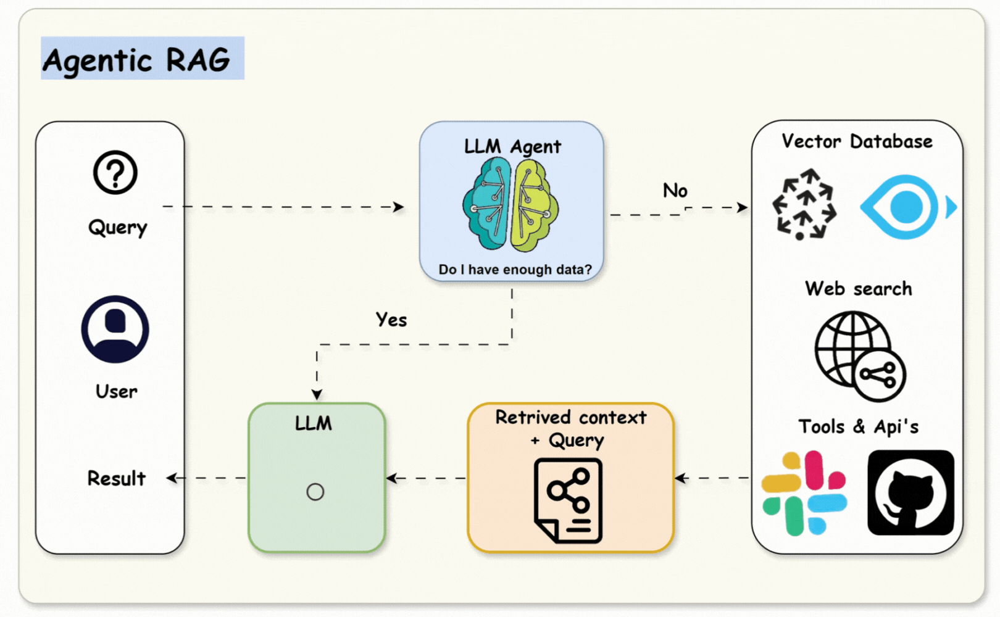

# Agentic System Architecture
This document explains how the LLM engine, RAG pipeline, and agent layer work together to process requests, retrieve context, execute tools, and generate grounded responses.

## Core Architectural Pillars

### 1. The Core LLM Engine (The "Brain")
The system uses upstream LLM APIs to handle natural language processing, complex multi-step reasoning, and contextual text generation.
* **Responsibilities**: Synthesizing final answers, formatting structured data outputs, parsing intent.
* **Boundaries**: The LLM does not inherently possess real-time information or access to private enterprise datasets.

### 2. The RAG Pipeline (The "Memory")
To ensure factual accuracy and prevent hallucinations, the system runs a Retrieval-Augmented Generation (RAG) workflow.
* **Responsibilities**: Indexing documents, creating vector embeddings, executing semantic searches against database nodes, injecting source context into the prompt.
* **Boundaries**: RAG provides static background text context but cannot take functional actions or call external systems.

### 3. The Agent Layer (The "Hands & Feet")
An autonomous orchestrator manages state-machine workflows and determines execution pathways based on the user's intent.
* **Responsibilities**: Tool execution (calling external APIs, querying production databases), loops, conditional routing, final goal evaluation.
* **Boundaries**: The agent often relies on the LLM to decide *when* to execute a tool, which makes execution-success tracking critical.

## Component Interactions
1. **Input**: A human user submits a query to the application layer.
2. **Intent Parsing**: The **Agent Layer** uses the **LLM Engine** to decide if it requires external data or tools.
3. **Data Fetching**: If data is missing, the **RAG Pipeline** extracts the relevant data snippets.
4. **Execution**: If action is required, the **Agent Layer** fires appropriate tool APIs.
5. **Synthesis**: The gathered context and tool results are sent to the **LLM Engine** to craft a coherent, grounded response.

## Related Documentation
* Refer to `evaluation-metrics.md` to review the KPIs used to evaluate and test each layer of this architecture during CI/CD pipelines and live production tracking.