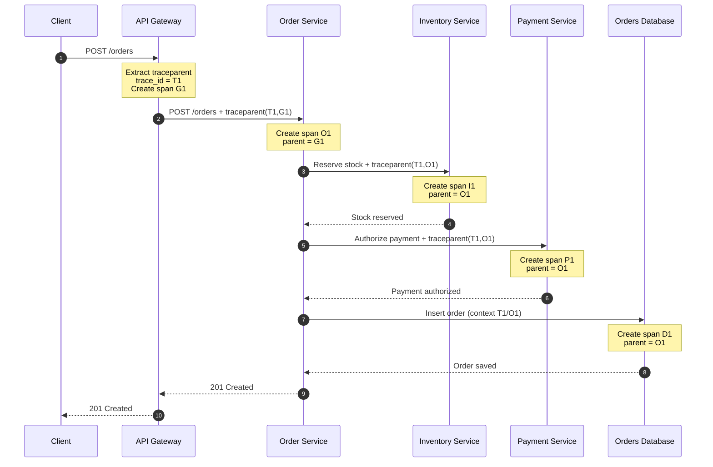

# Distributed tracing

Distributed tracing follows a request across processes, hosts, queues, and asynchronous workers. The trace context must cross each transport; otherwise every service creates an unrelated root span. A shared trace context connects spans created by different services, hosts, and workers.

## Why we need it

Without propagation, each service appears as an unrelated request. With it, an engineer can identify the service, queue, retry, or database operation responsible for end-to-end latency or failure.

## How it should be implemented

**Ingress** is the point where a request enters a service or system. For an HTTP API, it is usually the web server, load balancer, or API gateway that receives the request. For a message-driven service, it is the consumer that receives a message from a queue.

At ingress, extract the trace context from the incoming request, create a server or consumer span, and inject context into every outbound HTTP request or message. Use W3C `traceparent` and test propagation through asynchronous paths.

For example, when `checkout-service` receives `POST /orders`, its HTTP server extracts `traceparent` and starts a server span. When it calls `payment-service`, it sends the updated context in the outbound request so both spans remain part of the same trace.

### How trace IDs and span IDs connect

1. The first service creates a **trace ID** for the complete request and a **span ID** for its own work.
2. It propagates a W3C `traceparent` header containing the trace ID and the current span ID (as the parent ID).
3. The next service extracts that header, keeps the same trace ID, and creates a new span ID for its own work.
4. When that service calls another service, it sends the same trace ID with its new span ID as the parent.

The result is one end-to-end trace made from many service-specific spans. The trace timeline shows the complete request, while each span shows how long one service or operation took.

All spans in this example share the same `trace_id` (`T1`), so the tracing backend displays them as one end-to-end request. Each component has its own `span_id` (`G1`, `O1`, `I1`, `P1`, and `D1`). The parent relationship explains which operation caused the next operation. The resulting trace shows both the complete request duration and the time spent in each service or database call.

The standard `traceparent` header carries a version, trace ID, parent span ID, and sampling flags. Optional `tracestate` carries vendor-specific tracing information.

## Propagation details

Treat incoming trace context as untrusted input: limit its size, reject malformed values, and never use it for authorization. Preserve context through retries while creating a span for each attempt. For asynchronous work, carry context in message metadata and verify that worker spans retain the original trace relationship.

## Messaging example

The producer's span ends when the broker accepts the message. The consumer starts a process span using extracted context, then creates child spans for deserialization and database work. For a batch, use span links to every originating message and record batch size, lag, and partition as bounded attributes.

## Failure modes

- Missing propagation: disconnected traces and misleading latency.
- Shared mutable context: incorrect parentage under concurrency.
- Retries: one logical request appears successful while attempts hide the cost.
- Fan-out: a single slow dependency dominates the critical path; inspect critical-path timing rather than summing all spans.
- Clock skew: negative or inflated durations; use monotonic clocks locally and synchronize hosts.

Trace topology is a debugging aid, not a dependency inventory. Maintain ownership and dependency metadata separately so topology changes do not silently alter access or paging policy.

## Trade-offs and mistakes

Propagation adds headers and a little work to every request, but makes cross-service diagnosis possible. A broken proxy, queue adapter, or async task can silently split traces, so test every transport, retry, and dead-letter flow. Never trust a trace ID for identity or authorization.
